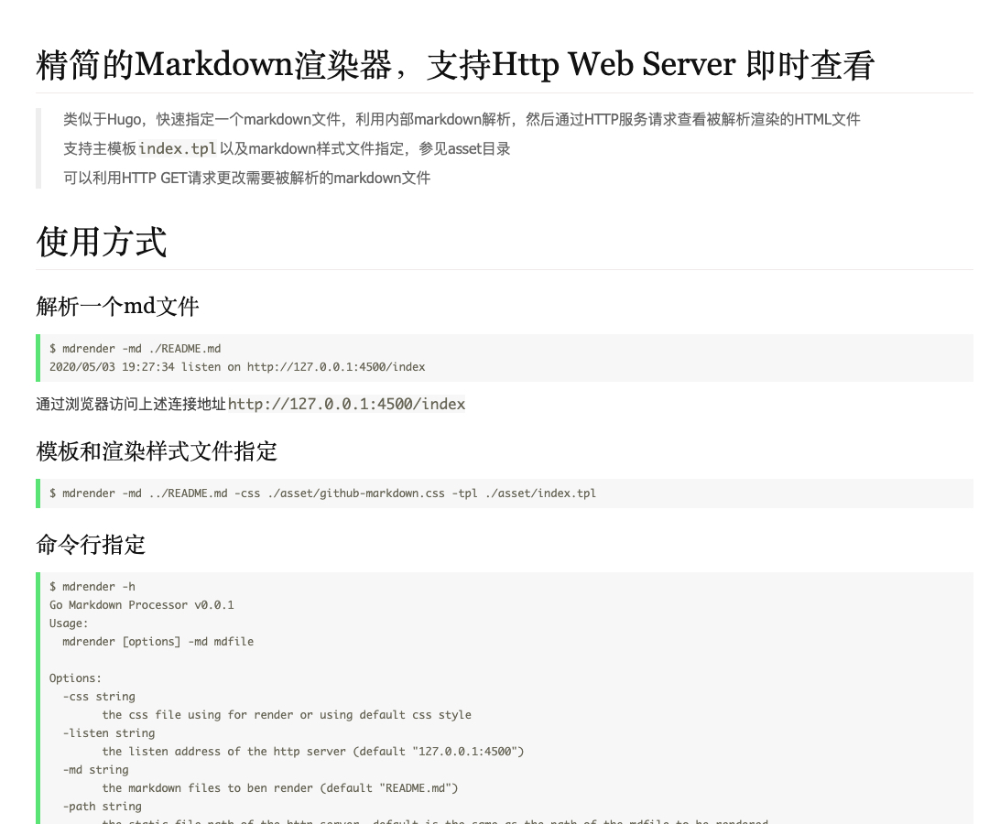
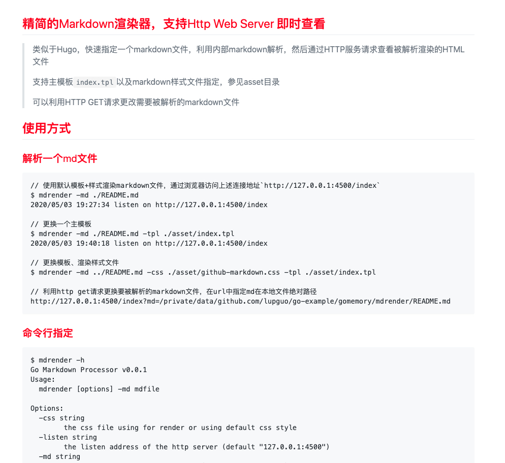

## 精简的Markdown渲染器，支持Http Web Server 即时查看
> 类似于Hugo，快速指定一个markdown文件，利用内部markdown解析，然后通过HTTP服务请求查看被解析渲染的HTML文件


### 特性
1. 支持通过命令行，在任意位置快速渲染一个指定markdown文件，然后通过浏览器来实时查看；
2. 支持编辑markdown文件后，同步实时查看更新后的渲染效果，无需重新执行`mdrender`命令；
3. 支持通过主模板、Markdown样式文件设定自己喜欢的的渲染风格（参见asset目录`index.tpl`以及`markdown.css`）；
4. 可以利用`HTTP GET`请求更改需要被解析的markdown文件

### 命令行安装
```bash
go get -u github.com/lupguo/mdrender
```

### 简单示例
> Tip: 注意把`$GOPATH/bin`加入到`PATH`目录

```
// 使用默认模板+样式渲染markdown文件，通过浏览器访问上述连接地址`http://127.0.0.1:4500/index`
$ mdrender -md ./README.md                                 
2020/05/03 19:27:34 listen on http://127.0.0.1:4500/index

// 更换一个主模板
$ mdrender -md ./README.md -tpl ./asset/index.tpl                                  
2020/05/03 19:40:18 listen on http://127.0.0.1:4500/index

// 更换模板、渲染样式文件
$ mdrender -md ../README.md -css ./asset/github-markdown.css -tpl ./asset/index.tpl

// 利用http get请求更换要被解析的markdown文件，在url中指定md在本地文件绝对路径
http://127.0.0.1:4500/index?md=/private/data/github.com/lupguo/go-example/gomemory/mdrender/README.md
```

### 命令行说明
```
$ mdrender -h         
Go Markdown Processor v0.0.1
Usage:
  mdrender [options] -md mdfile

Options:
  -css string
        the css file using for render or using default css style
  -listen string
        the listen address of the http server (default "127.0.0.1:4500")
  -md string
        the markdown files to ben render (default "README.md")
  -path string
        the static file path of the http server, default is the same as the path of the mdfile to be rendered
  -tpl string
        the template file for the html to be render, default is inner setting
```

### asset内的样式截图
`$ mdrender -md ./README.md` 默认样式截图：



`$ mdrender -md ../README.md -css ./asset/github-markdown.css -tpl ./asset/index.tpl` 指定模板、样式后的渲染效果：



### 后续计划
- 支持渲染http在线的markdown文档
- 支持渲染指定目录下的所有markdown文档，支持列表+单页样式查看（目前仅能快速查看单页）
- 静态文件渲染部分需要加强
- 其他想到再做补充

## 注意
1. 当前应用程序，目前仅支持单一MD文档渲染
2. 目前markdown中引用的静态文件，如果是相对路径，需要通过`-path`参数指定
3. 通过GET参数指定的
